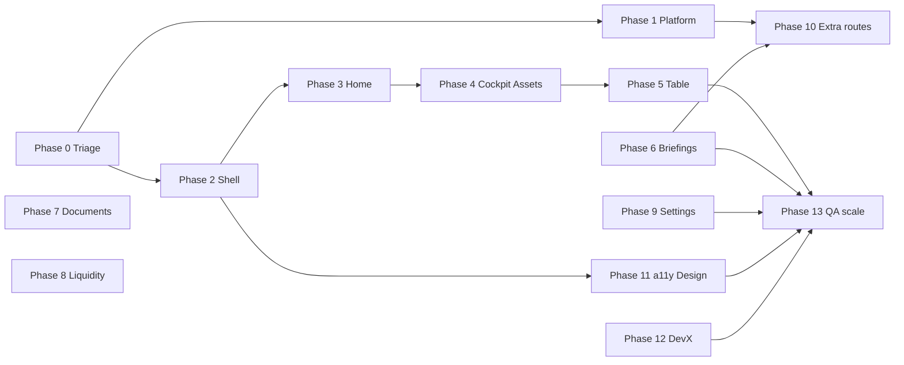

# ChiefRiskBot — Remediation plan (addresses product element log)

This plan responds to every gap, risk, and partial state recorded in `docs/PRODUCT_ELEMENT_LOG.md` (and the quick-reference symptom table in §14). Work is grouped so **triage and user-visible fixes** precede **structural refactors** and **deep QA**.

**Prerequisite:** If `PRODUCT_ELEMENT_LOG.md` is not yet on `main`, merge it first so engineering, design, and QA share one checklist.

---

## Goals

1. **No silent failures** — every interactive control either does something visible or states that it is coming soon.  
2. **One routing story** — canonical URLs, stable bookmarks, nav `href`s aligned with what users see.  
3. **One demo narrative** — copy and data agree with the live demo tenant.  
4. **Live data path** — Home and risk surfaces consume the same APIs as authenticated session where applicable.  
5. **Provable quality** — traced 401s, CSP/analytics decision, accessibility baseline, expanded e2e.

---

## Phase 0 — Triage and instrumentation (short)

| ID | Issue from log | Actions | Acceptance criteria | Owner |
|----|----------------|-----------|----------------------|-------|
| 0.1 | `fetch` **401** (unknown URL) | Record HAR or Playwright trace with `page.on('requestfailed')` / log response URLs; grep frontend for calls missing `Authorization` | Documented failing URL + fix (add auth, remove call, or handle 401) or intentional documented behavior | Eng |
| 0.2 | **Logout** unknown | Audit prod `_shell.js` / `_app.js` for logout entry points; add visible “Sign out” if session must be cleared from shell | User can end session in ≤2 clicks; tokens cleared; redirect to `/login` | Eng / Product |
| 0.3 | **Register / forgot password** partial | Manual + scripted happy/error paths; align API validation messages with UI | Three paths documented: sign-in, register, forgot; error copy passes copy review | Eng / Product |

---

## Phase 1 — Platform and delivery quick wins

| ID | Issue from log | Actions | Acceptance criteria | Owner |
|----|----------------|-----------|----------------------|-------|
| 1.1 | **CSP vs Cloudflare Insights** | Either (a) add `static.cloudflareinsights.com` to `script-src` / connect-src as required, or (b) remove the beacon snippet from HTML templates | No recurring CSP console errors; analytics policy documented | Eng / Ops |
| 1.2 | **URL mix** (`/cockpit` vs `/scenarios.html`) | Define canonical paths in edge config or app router; **301** old URLs to new; update `_shell.js` `NAV` `href`s to canonical form | All shell links use one style; old URLs redirect; no broken bookmarks in smoke list | Eng |
| 1.3 | **Nav `href` still `*.html`** while bar shows clean URLs | After 1.2, set `href` to canonical paths (or root-relative `/cockpit`) matching server | View-source / DOM `href` matches address bar pattern | Eng |
| 1.4 | **Demo “Aldridge” vs “Whitmore”** | Global search/replace in static HTML and marketing; single source of truth from API for dynamic strings | Grep finds no conflicting family-office name on demo surfaces | Content / Eng |

---

## Phase 2 — Shell information architecture and perceived broken chrome

| ID | Issue from log | Actions | Acceptance criteria | Owner |
|----|----------------|-----------|----------------------|-------|
| 2.1 | **Notifications / Help** inert | Product decision: ship **minimal** behavior — e.g. `Shell.toast('Notifications — coming soon')` and help opens `https://…/docs` or in-app modal with FAQ | Every top-bar icon produces visible feedback within 200ms | Product / Eng |
| 2.2 | **`.top` nested inside `main`** | Refactor templates: move `.top` sibling to `main` under `.app`, or use `<header role="banner">` outside `<main>`; adjust CSS grid | Landmark order: banner → nav → main; no duplicate “first tab stop” confusion in accessibility tree | Eng / Design |
| 2.3 | **`/auth/me` placeholder flash** | Show skeleton or “Loading workspace…” in `.who`/`.role` until resolved; avoid misleading static “CIO” | No incorrect identity text after first paint (or explicitly generic skeleton) | Eng / Design |

---

## Phase 3 — Home: static demo → session-aware dashboard

| ID | Issue from log | Actions | Acceptance criteria | Owner |
|----|----------------|-----------|----------------------|-------|
| 3.1 | Greeting / KPIs / briefing strip **static** | Wire components to existing portfolio/risk/briefing endpoints used elsewhere; fallback skeleton on error | Numbers update when portfolio changes; date matches reporting timezone | Eng |
| 3.2 | Copy mismatch tenant | Drive headline/deck from `/auth/me` + workspace settings | Workspace name in hero matches sidebar | Eng |

---

## Phase 4 — Risk Cockpit and Assets: data and interaction depth

| ID | Issue from log | Actions | Acceptance criteria | Owner |
|----|----------------|-----------|----------------------|-------|
| 4.1 | **Refresh** not proven to reload data | Implement `fetch` + loading state + `last_refreshed` timestamp; disable double-submit | Network shows repeat API call; UI shows loading then updated as-of | Eng |
| 4.2 | **Segment toggles** not proven to swap data | API returns buckets per dimension; front-end swaps SVG + legend from response | Changing segment changes legend labels/values (golden snapshot or contract test) | Eng |
| 4.3 | **Risk register rows** drill-down | Link rows to detail drawer or `/table` filtered row | Clicking row navigates or opens detail with stable URL where possible | Eng / Product |
| 4.4 | **Assets “Add position”** | End-to-end: open editor → validate → save → reflect in table and cockpit | E2e covers happy path + validation error | Eng / QA |

---

## Phase 5 — Positions (`/table`): uploads, save, row links

| ID | Issue from log | Actions | Acceptance criteria | Owner |
|----|----------------|-----------|----------------------|-------|
| 5.1 | **Upload document** unverified | E2e with fixture file; assert queue row or toast | Upload succeeds in CI against staging API | Eng / QA |
| 5.2 | **Add row / Save / close** | Define behavior for empty save (disable Save or show validation); test modal lifecycle | Documented behavior + tests | Eng / Product |
| 5.3 | **Row-level links** | Spec each link target; add Playwright loop or data-driven test for N sample rows | At least representative row types covered | QA |

---

## Phase 6 — Briefings: async job to completion

| ID | Issue from log | Actions | Acceptance criteria | Owner |
|----|----------------|-----------|----------------------|-------|
| 6.1 | **Generate** completion / error / timeout | Poll or WebSocket until terminal state; toast on error; link to `/briefing?id=` on success | E2e waits for terminal state (or mocks API) | Eng |
| 6.2 | **History rows → reader** | Ensure list passes id; reader loads content; back navigation preserves list filter | Click row → reader shows same briefing id | Eng |

---

## Phase 7 — Documents: upload and review

| ID | Issue from log | Actions | Acceptance criteria | Owner |
|----|----------------|-----------|----------------------|-------|
| 7.1 | **Upload** pipeline | Same as 5.1 if shared component; status column updates | Status transitions visible | Eng |
| 7.2 | **Review** | Define review UI state machine; assert post-click | E2e or visual snapshot for review screen | Eng / QA |

---

## Phase 8 — Liquidity: confirm read-only vs interactive

| ID | Issue from log | Actions | Acceptance criteria | Owner |
|----|----------------|-----------|----------------------|-------|
| 8.1 | No in-content controls | If intentional: add short “read-only snapshot” caption; if not: add stress sliders / horizon per product spec | Product spec documented in UI | Product / Eng |

---

## Phase 9 — Settings: full form matrix

| ID | Issue from log | Actions | Acceptance criteria | Owner |
|----|----------------|-----------|----------------------|-------|
| 9.1 | **Unknown** full matrix | Inventory every control; map to API `PATCH`; add integration tests per section | Changing each field persists after reload; hash sections scroll into view | Eng / QA |

---

## Phase 10 — Extra surfaces (Scenarios, Access, Briefing reader)

| ID | Issue from log | Actions | Acceptance criteria | Owner |
|----|----------------|-----------|----------------------|-------|
| 10.1 | **Scenarios / Access** not in shell | Add to `NAV` (with icon) or remove public routes; if kept, use clean paths `/scenarios`, `/access` with redirects from `.html` | IA matches product map; no orphan pages | Product / Eng |
| 10.2 | **Briefing reader** query contract | Document and test `?id=` (or path param); deep link from briefings list | E2e: list → reader → back | Eng / QA |

---

## Phase 11 — Design system and accessibility

| ID | Issue from log | Actions | Acceptance criteria | Owner |
|----|----------------|-----------|----------------------|-------|
| 11.1 | **Material Symbols** variant drift | Align `<link>` with `DESIGN.md` (opsz, wght, FILL, GRAD) or document intentional prod subset | DESIGN.md and prod match or deviation is documented | Design / Eng |
| 11.2 | **Accessibility unknown** | Run axe in CI on key routes; keyboard walk order after shell refactor; fix WCAG AA failures for body text | CI fails on new serious a11y violations; keyboard path documented | Eng / Design |
| 11.3 | **SVG donut accessibility** | If arcs are decorative only: `aria-hidden`; if interactive: buttons + `aria-pressed` per segment | Screen reader behavior documented | Eng |

---

## Phase 12 — Developer experience and confusion (repo vs prod)

| ID | Issue from log | Actions | Acceptance criteria | Owner |
|----|----------------|-----------|----------------------|-------|
| 12.1 | **Token key mismatch** (MVP `crb.auth_token.*` vs prod `crb_token`) | README “Environments” table; optional shared `auth_storage.ts` if monorepo later | New engineer knows which keys apply where | Eng |

---

## Phase 13 — QA automation expansion

| ID | Issue from log | Actions | Acceptance criteria | Owner |
|----|----------------|-----------|----------------------|-------|
| 13.1 | **Coverage gaps** (positions rows, settings matrix) | Data-driven Playwright from exported fixture or API seed | Nightly run covers checklist in `PRODUCT_ELEMENT_LOG.md` §4–12 | QA / Eng |
| 13.2 | **Maintenance** (log §15) | Wire scheduled prod smoke; alert on auth failure | Slack/email on red smoke | Ops |

---

## Sequencing and dependencies

**Parallel tracks:** Phase 1 (routing/CSP/copy) can run parallel to Phase 0.1–0.2. Phase 11 (a11y) should follow Phase 2 (shell DOM order). Phase 3–9 are mostly serial per product priority — reorder if IC demo needs Briefings before Table.

---

## Suggested priority for a single sprint

1. **0.1** (401 trace) + **1.1** (CSP/analytics) — removes mystery noise.  
2. **2.1** (Notifications/Help) + **2.3** (loading pill) — highest perceived quality.  
3. **1.2–1.4** (URLs + copy) — low risk, high coherence.  
4. **3.1** (Home live data) + **4.1–4.2** (Cockpit refresh/segments) — demo credibility.  
5. **6.1** (Briefing completion) + **10.1** (nav for scenarios/access) — narrative completeness.

---

## Definition of done (global)

- [ ] No undocumented 401s in browser console on happy-path demo session.  
- [ ] CSP and analytics decision recorded in runbook.  
- [ ] All eight shell routes + briefing reader + login covered in CI smoke.  
- [ ] `PRODUCT_ELEMENT_LOG.md` updated: each row either **OK** or explicitly deferred with link to ticket.

---

*Maintainer: update this plan when scope changes; link each row to a GitHub issue for execution tracking.*
