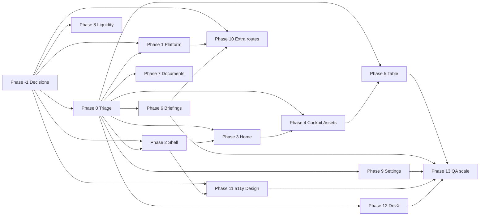

# ChiefRiskBot — Product remediation plan

Status: Draft, now executing  
Last updated: 2026-05-12  
Execution branch: `cursor/product-remediation-plan-e802`  
Plan owner: Product/Engineering until a named DRI is assigned  
Canonical evidence log: `docs/PRODUCT_ELEMENT_LOG.md`

This plan responds to every gap, risk, and partial state recorded in `docs/PRODUCT_ELEMENT_LOG.md`. It is intentionally self-contained: each row restates the user-visible issue, links back to the evidence log by ID, and includes acceptance criteria that QA can verify without needing private context.

Work is grouped so **triage and user-visible fixes** precede **structural refactors** and **deep QA**.

---

## Scope

### In scope

- `frontend-mvp/`, the current runtime surface used by the rollout usability sweep.
- Backend/API changes required to remove 401s, persist settings, generate briefings, upload documents, and expose live dashboard data.
- Smoke, accessibility, and console-error automation required to keep fixes from regressing.
- Documentation needed to remove repo/prod ambiguity.

### Out of scope for this remediation pass

- Dark mode. `frontend-design-ideal/DESIGN.md` explicitly keeps it out of v1.
- A net-new visual redesign beyond fixes required by `frontend-design-ideal/DESIGN.md`.
- Multi-tenant administration beyond the current single-workspace demo model.
- Replacing the backend framework or changing deployment providers.

---

## Goals

1. **No silent failures** — every interactive control either does something visible or states that it is coming soon.  
2. **One routing story** — canonical URLs, stable bookmarks, nav `href`s aligned with what users see.  
3. **One demo narrative** — copy and data agree with the live demo tenant.  
4. **Live data path** — Home and risk surfaces consume the same APIs as authenticated session where applicable.  
5. **Provable quality** — traced 401s, CSP/analytics decision, accessibility baseline, expanded e2e.

---

## Phase -1 — Product and repo decisions before broad execution

| ID | Evidence | Decision needed | Acceptance criteria | Roles | Risk / rollback | Issue |
|----|----------|-----------------|---------------------|-------|-----------------|-------|
| -1.1 | PEL-12.1 | Pick `frontend-mvp/` as the execution surface for this pass; freeze `frontend/` except for archival or migration work; keep `frontend-design-ideal/` as design reference only. | README or runbook names the active frontend; new remediation PRs touch `frontend-mvp/` unless explicitly migrating code. | Product / Eng | Low; documentation-only decision can be reverted in PR. | TBD |
| -1.2 | PEL-8.1 | Decide whether Liquidity is intentionally read-only in v1 or should expose stress controls. | Decision captured in `docs/PRODUCT_ELEMENT_LOG.md`; engineering row promoted only after decision. | Product | Low; no runtime change until promoted. | TBD |
| -1.3 | PEL-10.1 | Decide whether Scenarios and Access stay in the shell IA or become private/admin-only routes. | Shell route list and deployed route list match the decision. | Product / Eng | Medium; route changes can break bookmarks, so redirects remain until smoke passes. | TBD |
| -1.4 | PEL-11.3 | Decide whether donut/SVG segments are decorative summaries or interactive controls. | Accessibility implementation has one chosen contract, not an `if` branch in execution rows. | Product / Design / Eng | Low; decision only. | TBD |

---

## Phase 0 — Triage and instrumentation

| ID | Evidence | Issue | Actions | Acceptance criteria | Roles | Risk / rollback | Issue |
|----|----------|-------|---------|---------------------|-------|-----------------|-------|
| 0.1 | PEL-0.1 | Browser console shows an undocumented 401 during happy-path demo. | Record HAR or Playwright trace with response URLs; grep frontend calls missing `Authorization`; classify failing URL as bug, expected unauthenticated probe, or removed call. | `docs/PRODUCT_ELEMENT_LOG.md` names the failing URL and final disposition; no undocumented 401 remains in smoke output. | Eng / QA | Low; tracing-only until a fix is identified. | TBD |
| 0.2 | PEL-0.2 | Logout was reported as unknown. | Verify `frontend-mvp/_shell.js` and `_app.js` logout path; add smoke assertion that sign out clears auth storage and redirects to login. | User can end session in <=2 clicks; token keys are cleared; smoke covers the flow. | Eng / QA | Low; logout already exists, add test first. | TBD |
| 0.3 | PEL-0.3 | Register and forgot-password paths have partial verification. | Script happy and error paths; align validation copy where UI/API disagree. | Sign-in, register, and forgot-password flows each have documented pass/fail behavior and copy-reviewed errors. | Eng / Product / QA | Medium; auth copy changes can affect conversion, so isolate UI text from API semantics. | TBD |
| 0.4 | PEL-13.2 | No consolidated browser error signal for remediation work. | Extend smoke tooling to capture console errors, request failures, and failed responses with URLs. | CI artifact contains route, console message, failing URL, status, and auth state for every failure. | Eng / Ops | Low; can disable stricter failure gate while signal stabilizes. | TBD |

---

## Phase 1 — Platform and delivery quick wins

| ID | Evidence | Issue | Actions | Acceptance criteria | Roles | Risk / rollback | Issue |
|----|----------|-------|---------|---------------------|-------|-----------------|-------|
| 1.1 | PEL-1.1 | CSP and Cloudflare Insights policy is unclear. | Either add Cloudflare Insights domains to CSP and document analytics policy, or remove the beacon from shipped templates. | No recurring CSP console errors; runbook says whether analytics is enabled and why. | Eng / Ops | Medium; CSP can block scripts, so deploy behind smoke and revert CSP header/template change if auth or app boot fails. | TBD |
| 1.2 | PEL-1.2 | URLs mix clean paths and `.html` artifacts. | Define canonical route style in deployment config; add redirects from old URLs; update shell links after redirects exist. | Every shell link uses one style; legacy bookmarks redirect; smoke covers old and canonical route for at least Home, Cockpit, Briefings, and Settings. | Eng | High; route changes can break external links, so keep redirects for the whole remediation pass. | TBD |
| 1.3 | PEL-1.3 | Shell nav hrefs can disagree with address bar style. | After 1.2, set `frontend-mvp/_shell.js` `href`s to canonical paths. | DOM `href` pattern matches deployed canonical paths on all shell links. | Eng / QA | Medium; rollback is reverting `_shell.js` hrefs while preserving server redirects. | TBD |
| 1.4 | PEL-1.4 | Demo tenant naming must be consistent across static HTML, seeded data, and production demo copy. | Verify actual conflicting names before replacing; current repo evidence shows `Aldridge` but no `Whitmore`, so identify the external or prod surface if conflict remains. | Grep and smoke screenshots show one canonical family-office name on demo surfaces. | Content / Eng | Low; copy-only, but validate screenshots before demo. | TBD |

---

## Phase 2 — Shell information architecture and perceived broken chrome

| ID | Evidence | Issue | Actions | Acceptance criteria | Roles | Risk / rollback | Issue |
|----|----------|-------|---------|---------------------|-------|-----------------|-------|
| 2.1 | PEL-2.1 | Interactive shell chrome can appear inert. | Add minimal visible feedback for v1-only controls, starting with the workspace selector: a shell toast should explain the current support-managed workspace model. | Every shell control either performs its action or shows visible feedback within 200ms. | Product / Eng | Low; local shell JS/CSS only, revert `_shell.js` and `_shell.css` if layout regresses. | TBD |
| 2.2 | PEL-2.2 | Header/top-bar landmark structure needs an accessibility pass. | Refactor templates so top chrome is outside page `<main>` or uses a valid banner/header pattern; adjust CSS grid. | Landmark order is banner -> nav -> main; keyboard first tab stop is not duplicated. | Eng / Design / QA | Medium; shared shell layout affects every page, so use screenshot diff before deploy. | TBD |
| 2.3 | PEL-2.3 | Identity/workspace text can flash misleading placeholders. | Keep generic loading labels until session/settings resolve; avoid hard-coded roles such as CIO before auth data arrives. | No incorrect identity text appears after first paint; placeholder text is explicitly generic. | Eng / Design | Low; copy/state change in shell. | TBD |

---

## Phase 3 — Home: static demo to session-aware dashboard

| ID | Evidence | Issue | Actions | Acceptance criteria | Roles | Risk / rollback | Issue |
|----|----------|-------|---------|---------------------|-------|-----------------|-------|
| 3.1 | PEL-3.1 | Home KPIs and briefing strip must prove they use session data. | Wire Home components to existing portfolio, risk, and briefing endpoints used elsewhere; keep skeleton/error fallback. | Numbers change when seed portfolio changes; date uses reporting timezone; smoke verifies at least one live value. | Eng / QA | Medium; blank dashboard risk if API seed missing, so fallback must preserve demo readability. | TBD |
| 3.2 | PEL-3.2 | Home workspace copy can drift from sidebar/session. | Drive headline and deck from session/settings values. | Workspace name in Home hero matches sidebar workspace. | Eng | Low; copy binding only. | TBD |

---

## Phase 4 — Risk Cockpit and Assets: data and interaction depth

| ID | Evidence | Issue | Actions | Acceptance criteria | Roles | Risk / rollback | Issue |
|----|----------|-------|---------|---------------------|-------|-----------------|-------|
| 4.1 | PEL-4.1 | Refresh button must prove it reloads data. | Implement fetch, loading state, `last_refreshed` timestamp, and double-submit guard. | Network shows repeat API call; UI shows loading then updated as-of timestamp. | Eng / QA | Medium; preserve previous data on refresh failure. | TBD |
| 4.2 | PEL-4.2 | Segment toggles must prove they swap data. | API returns buckets per dimension; frontend swaps SVG and legend from response; add contract test for response shape. | Changing segment changes legend labels and values; contract test covers bucket keys. | Eng / QA | Medium; fallback to prior segment if response invalid. | TBD |
| 4.3 | PEL-4.3 | Risk register rows need a drill-down contract. | Link rows to detail drawer or `/table` filtered row. | Clicking row opens/navigates to stable detail state; Back returns to previous context. | Eng / Product | Medium; row links touch user workflow, keep feature flag or safe no-op fallback. | TBD |
| 4.4 | PEL-4.4 | Assets "Add position" needs end-to-end behavior. | Open editor, validate, save, reflect in table and cockpit. | E2E covers happy path and validation error. | Eng / QA | Medium; failed save must not mutate local UI. | TBD |

---

## Phase 5 — Positions (`/table`): uploads, save, row links

| ID | Evidence | Issue | Actions | Acceptance criteria | Roles | Risk / rollback | Issue |
|----|----------|-------|---------|---------------------|-------|-----------------|-------|
| 5.1 | PEL-5.1 | Upload document flow is unverified. | E2E with fixture file; assert queue row or success toast. | Upload succeeds in CI against staging API and shows visible status. | Eng / QA | Medium; use small fixture and clean up uploaded artifact. | TBD |
| 5.2 | PEL-5.2 | Add-row modal empty-save behavior is undefined. | Disable Save until required fields are valid; show validation if user attempts invalid close/save; test modal lifecycle. | Empty save cannot silently succeed; invalid fields show copy; close discards unsaved empty row. | Eng / Product / QA | Low; form validation only. | TBD |
| 5.3 | PEL-5.3 | Row-level links lack route coverage. | Spec each link target; add Playwright loop over representative instrument/document rows. | At least one row per link target is covered in CI. | QA / Eng | Low; test-first, then link fixes. | TBD |

---

## Phase 6 — Briefings: async job to completion

| ID | Evidence | Issue | Actions | Acceptance criteria | Roles | Risk / rollback | Issue |
|----|----------|-------|---------|---------------------|-------|-----------------|-------|
| 6.1 | PEL-6.1 | Briefing generation needs completion, error, and timeout states. | Poll until terminal state; toast on error; link to `briefing.html?id=` on success; bound polling interval. | E2E waits for terminal state with mocked or seeded API; polling stops after success/error/timeout. | Eng / QA | High; uncontrolled polling can create API/Claude load, so enforce interval and timeout. | TBD |
| 6.2 | PEL-6.2 | History rows must deep-link to the same briefing in reader. | Ensure list passes briefing id; reader loads content; back preserves list context where possible. | Click row -> reader shows same briefing id and title. | Eng / QA | Low; link contract only. | TBD |

---

## Phase 7 — Documents: upload and review

| ID | Evidence | Issue | Actions | Acceptance criteria | Roles | Risk / rollback | Issue |
|----|----------|-------|---------|---------------------|-------|-----------------|-------|
| 7.1 | PEL-7.1 | Document upload pipeline needs visible status. | Reuse upload component where possible; update status column through queued, processing, ready/error. | Status transitions are visible in UI and covered by one E2E. | Eng / QA | Medium; failed processing must show retry/error state. | TBD |
| 7.2 | PEL-7.2 | Review action needs a state machine. | Define states: preview unavailable, preview loading, preview ready, preview failed; implement and test the clicked review screen. | Clicking Review always lands in exactly one documented state with accessible heading. | Eng / QA | Medium; preview rendering may vary by file type, preserve download fallback. | TBD |

---

## Phase 8 — Liquidity: confirm read-only vs interactive

| ID | Evidence | Issue | Actions | Acceptance criteria | Roles | Risk / rollback | Issue |
|----|----------|-------|---------|---------------------|-------|-----------------|-------|
| 8.1 | PEL-8.1 | Liquidity has no in-content controls, but intent is undecided. | After -1.2: if read-only, add "read-only snapshot" caption; if interactive, add stress horizon controls from product spec. | UI text matches the product decision; smoke asserts the caption or control exists. | Product / Eng / QA | Low if caption, medium if controls; controls need API fallback. | TBD |

---

## Phase 9 — Settings: full form matrix

| ID | Evidence | Issue | Actions | Acceptance criteria | Roles | Risk / rollback | Issue |
|----|----------|-------|---------|---------------------|-------|-----------------|-------|
| 9.1 | PEL-9.1 | Settings persistence matrix is unknown. | Inventory every settings control in `frontend-mvp/settings.html`; map to API field or mark read-only; add integration tests per section. | Every editable field persists after reload; non-editable fields are disabled/read-only with copy; hash sections scroll into view. | Eng / QA | Medium; settings saves can affect demos, so test against isolated tenant/seed. | TBD |

---

## Phase 10 — Extra surfaces (Scenarios, Access, Briefing reader)

| ID | Evidence | Issue | Actions | Acceptance criteria | Roles | Risk / rollback | Issue |
|----|----------|-------|---------|---------------------|-------|-----------------|-------|
| 10.1 | PEL-10.1 | Scenarios and Access route visibility must match product IA. | After -1.3: keep both in `frontend-mvp/_shell.js` or remove public routes and add redirects. | Every route in shell returns 200; no deployed HTML page is reachable but absent from approved IA. | Product / Eng / QA | Medium; preserve redirects until smoke confirms. | TBD |
| 10.2 | PEL-10.2 | Briefing reader deep-link contract needs coverage. | Document and test `briefing.html?id=`; deep-link from briefings list. | E2E: list -> reader -> back, reader loads same id. | Eng / QA | Low; link/test only unless reader API changes. | TBD |

---

## Phase 11 — Design system and accessibility

| ID | Evidence | Issue | Actions | Acceptance criteria | Roles | Risk / rollback | Issue |
|----|----------|-------|---------|---------------------|-------|-----------------|-------|
| 11.1 | PEL-11.1 | Material Symbols loading can drift from `frontend-design-ideal/DESIGN.md`. | Align `<link>` with the DESIGN.md Material Symbols contract or document intentional production subset. | DESIGN.md and production font load match, or documented exception exists. | Design / Eng | Low; font loading only, but screenshot diff icons. | TBD |
| 11.2 | PEL-11.2 | Accessibility baseline is unknown. | Run axe in CI on Home, Cockpit, Briefings, Table, Documents, Settings, Access, Scenarios, and Login; keyboard walk after shell refactor. | CI fails on new serious/critical axe violations; keyboard path is documented. | Eng / Design / QA | Medium; gating may need warning-only burn-in before fail mode. | TBD |
| 11.3 | PEL-11.3 | SVG donut accessibility contract is undecided. | After -1.4, implement decorative `aria-hidden` or interactive button/`aria-pressed` pattern. | Screen reader behavior matches chosen contract and is covered in accessibility notes. | Eng / Design / QA | Low if decorative, medium if interactive. | TBD |

---

## Phase 12 — Developer experience and confusion (repo vs prod)

| ID | Evidence | Issue | Actions | Acceptance criteria | Roles | Risk / rollback | Issue |
|----|----------|-------|---------|---------------------|-------|-----------------|-------|
| 12.1 | PEL-12.1 | Token key mismatch creates repo/prod confusion. | Document active keys; for this pass, keep `frontend-mvp` keys (`crb.auth_token`, `crb.auth_token.session`, `crb.auth_storage`) and ensure logout clears both `crb_` and `crb.` prefixes except API override. | Environment docs identify active token keys; smoke validates logout clears active keys. | Eng / QA | Medium; auth storage changes can strand sessions, so migrate only with explicit test. | TBD |

---

## Phase 13 — QA automation expansion

| ID | Evidence | Issue | Actions | Acceptance criteria | Roles | Risk / rollback | Issue |
|----|----------|-------|---------|---------------------|-------|-----------------|-------|
| 13.1 | PEL-13.1 | Coverage gaps remain across positions rows and settings matrix. | Add data-driven Playwright from exported fixture or API seed. | Nightly run covers all non-deferred `PRODUCT_ELEMENT_LOG.md` rows from phases 3-11. | QA / Eng | Medium; seed drift can make tests flaky, so pin fixture data. | TBD |
| 13.2 | PEL-13.2 | Ongoing maintenance signal is missing. | Wire scheduled prod smoke and alert on auth failure, 5xx, console-error budget breach, and CSP violation reports. | Alert fires with route, status, URL, and run link on red smoke. | Ops / Eng | Medium; alert noise likely during burn-in, start warning-only. | TBD |

---

## Sequencing and dependencies

**Parallel tracks:** Phase 0 instrumentation should start first, but Phase 1 CSP/copy investigation and Phase 2 visible-feedback fixes can run in parallel because they are low-coupling. Phase 11 should follow Phase 2 for shell landmark work. Phase 3-9 are mostly priority-ordered user journeys, not hard technical dependencies; reorder if an investment-committee demo needs Briefings before Table.

---

## Execution priority

1. **-1.1**, **0.1**, **0.4** — remove ambiguity about active frontend and make failures observable.
2. **2.1**, **2.3** — fix the highest perceived-quality shell issues without waiting for routing work.
3. **1.1**, **1.4** — clean noisy CSP/copy issues with low runtime coupling.
4. **1.2-1.3**, **10.1-10.2** — align IA and routing once redirects are ready.
5. **3.1**, **4.1-4.2**, **6.1** — demo credibility through live dashboard/risk/briefing paths.
6. **5.1-5.3**, **7.1-7.2**, **9.1**, **11.2**, **13.1-13.2** — broaden workflow coverage and regression protection.

---

## Definition of done (global)

- [ ] No undocumented 401s in browser console on happy-path demo session.  
- [ ] Console-error budget for smoke run is declared and at or below budget.
- [ ] CSP and analytics decision recorded in runbook.  
- [ ] All shell routes, briefing reader, and login covered in CI smoke.  
- [ ] Serious/critical axe violations on Home, Cockpit, Briefings, Table, Documents, Settings, Access, Scenarios, and Login are zero or explicitly deferred with issue links.
- [ ] `frontend-mvp/` is documented as the execution surface for this pass, or the plan is updated with a migration decision.
- [ ] `PRODUCT_ELEMENT_LOG.md` updated: each row either **OK** or explicitly deferred with link to ticket.

---

Maintainer note: update this plan when scope changes; replace `TBD` issue placeholders with GitHub issue links before marking the plan "executing" for a larger team.
